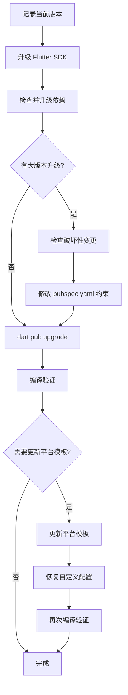

# Flutter 全量升级

Flutter 项目的完整升级流程，包括 SDK、依赖和平台模板代码。

## 升级流程



## 步骤 1：升级 Flutter SDK

```bash
# 记录升级前版本
flutter --version
dart --version

# 升级 SDK（本地有修改时需要 --force）
flutter upgrade
# 或
flutter upgrade --force

# 确认升级后版本 + 环境状态
flutter doctor
```

## 步骤 2：检查并升级依赖

```bash
# 检查所有过时依赖（在 workspace 根目录执行）
dart pub outdated

# 各子模块也可单独检查
cd <app模块路径> && flutter pub outdated
```

### 依赖分类处理

| 类别 | 判断方法 | 处理方式 |
|------|----------|----------|
| 约束内可升级 | Upgradable 列有新版本 | `dart pub upgrade` 自动升级 |
| 大版本升级 | Resolvable 列有新版本但 Upgradable 没有 | 需手动修改 pubspec.yaml 约束 |
| SDK 锁定 | Resolvable 也没有新版本 | 无法升级，等 Flutter SDK 更新 |

### 大版本升级检查

修改约束前，必须确认破坏性变更不影响现有代码：

1. 访问 `https://pub.dev/packages/{包名}/changelog` 查看 BREAKING CHANGE
2. 搜索项目中该包的实际使用方式（`grep -rn 'import.*包名' lib/`）
3. 对照破坏性变更列表，逐条确认是否影响当前用法

```bash
# 修改约束后执行升级
dart pub upgrade
```

## 步骤 3：编译验证

加载 `flutter-build` skill 执行编译。

## 步骤 4：更新平台模板代码（可选）

Flutter 各平台目录（android/、ios/、macos/ 等）在 `flutter create` 时生成，之后不会自动更新。

### 检查模板版本

```bash
# 查看项目创建时的 SDK revision
cat <app模块路径>/.metadata
```

### 更新方式

| 方式 | 命令 | 说明 |
|------|------|------|
| 仅补充新文件 | `flutter create .` | 安全，不覆盖已有文件 |
| 全量覆盖 | `flutter create --overwrite --org <org> --project-name <name> .` | 用最新模板覆盖所有平台文件 |

### ⚠️ 全量覆盖的关键步骤

全量覆盖会重置所有文件（包括你的代码），必须按以下流程操作：

```bash
# 1. 先暂存当前工作区变更
git stash push -m "pre-template-update"

# 2. 在 app 目录执行覆盖（--org 和 --project-name 需与原项目一致）
cd <app模块路径>
flutter create --overwrite --org <org> --project-name <name> .

# 3. 立即恢复被覆盖的项目文件
git checkout -- pubspec.yaml lib/ analysis_options.yaml README.md

# 4. 回到 workspace 根目录，恢复暂存的变更
cd <workspace根目录>
git stash pop

# 5. 检查并恢复自定义配置（见下方检查清单）
```

### 自定义配置检查清单

全量覆盖后必须逐项检查以下文件：

| 文件 | 检查内容 |
|------|----------|
| `macos/Runner/DebugProfile.entitlements` | 模板会添加 `app-sandbox`，若项目不使用沙箱必须删除；自定义权限（如 `files.user-selected.read-write`）是否被删除 |
| `macos/Runner/Release.entitlements` | 同上 |
| `ios/Runner/Info.plist` | 自定义权限描述（相机、相册等）是否被删除 |
| `android/app/src/main/AndroidManifest.xml` | 自定义权限声明是否被重置 |
| `android/app/build.gradle.kts` | namespace/applicationId 是否正确 |
| `macos/Runner/Configs/AppInfo.xcconfig` | 应用名称、Bundle ID 是否正确 |

```bash
# 用 git diff 检查所有平台变更
git diff -- <app模块路径>/macos/Runner/*.entitlements
git diff -- <app模块路径>/ios/Runner/Info.plist
git diff -- <app模块路径>/android/
```

### 清理旧文件

```bash
# 如果 Android 包名从 com.example 变为正确包名，删除旧目录
rm -rf android/app/src/main/kotlin/com/example
```

## 常见问题

| 问题 | 原因 | 解决 |
|------|------|------|
| `flutter upgrade` 提示 local changes | Flutter SDK 目录有本地修改 | 使用 `--force` 参数 |
| `git checkout --` 恢复多个文件时部分失败 | 其中一个 pathspec 不存在导致整条命令失败 | 确保所有路径存在，或分多次执行 |
| 覆盖后 entitlements 丢失权限 | 模板只包含默认权限 | 手动恢复自定义权限 |
| 覆盖后 macOS 功能异常（文件访问被拒） | 模板添加了 `app-sandbox` 但项目不使用沙箱 | 从 entitlements 中删除 `app-sandbox` |
| `pubspec.lock` 没有 git diff | workspace 根目录的 pubspec.lock 被 gitignore | 这是正常行为 |
| 部分传递依赖无法升级 | 被 Flutter SDK 或其他包锁定 | 等 SDK 或上游包更新 |
