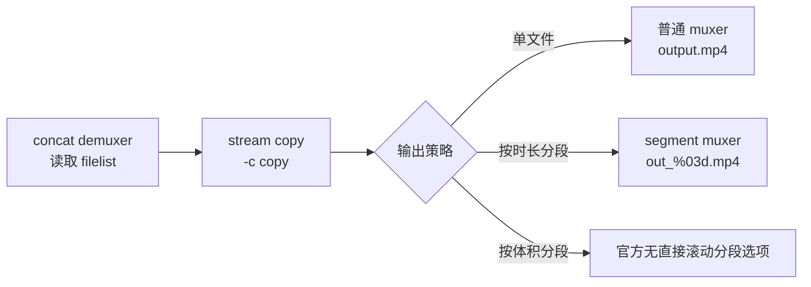

# ffmpeg 分段输出

## 速查

| 目标 | 是否可直接做 | 主要能力 | 备注 |
|------|------|------|------|
| 按时长切成多个文件 | ✅ | [`segment muxer`](https://ffmpeg.org/ffmpeg-formats.html#segment_002c-stream_005fsegment_002c-ssegment) 的 `-segment_time` / `-segment_times` | 可与 `-c copy` 组合 |
| 按指定时间点切 | ✅ | `-segment_times` | 适合已知边界 |
| 按帧号切 | ✅ | `-segment_frames` | 更偏底层能力 |
| 按文件体积连续切成多个文件 | ❌ | 官方分段 muxer 无对应阈值选项 | `-fs` 只会截断当前输出 |
| 合并时顺便分段 | ✅ | concat demuxer 输入 + segment muxer 输出 | 一条命令即可 |



## 官方结论

[`segment muxer`](https://ffmpeg.org/ffmpeg-formats.html#segment_002c-stream_005fsegment_002c-ssegment) 提供：

- `-segment_time`：按固定时长切分
- `-segment_times`：按指定时间点切分
- `-segment_frames`：按指定帧号切分

官方同时明确：

- `Every segment starts with a keyframe of the selected reference stream`
- `the segment muxer will start the new segment with the key frame found next after the specified start time`
- `The segment muxer works best with a single constant frame rate video.`
- `splitting may not be accurate, unless you force the reference stream key-frames at the given time`

这意味着：

1. **按时长分段是原生支持的**
2. **无损 stream copy 时，切点通常仍受关键帧约束**
3. 若想把切点精确钉死到任意时间，常见办法是 `force_key_frames`，但那通常意味着重新编码，不适合无损场景

## 与当前拼接命令能否合并为一条

可以。

`ffmpeg` 的命令模型本身就是“任意输入 + 一个输出 muxer”([官方说明](https://ffmpeg.org/ffmpeg-doc.html))，因此可以直接把：

- 输入端保持为 concat demuxer
- 编码端保持为 `-c copy`
- 输出端从普通文件 muxer 换成 `segment muxer`

示例：

```bash
ffmpeg \
  -f concat -safe 0 -i filelist.txt \
  -map 0 \
  -c copy \
  -f segment \
  -segment_time 120 \
  -reset_timestamps 1 \
  out_%03d.mp4
```

如果需要保留 mp4 的 `faststart` 行为，可继续给分段输出附加 muxer 选项：

```bash
ffmpeg \
  -f concat -safe 0 -i filelist.txt \
  -map 0 \
  -c copy \
  -f segment \
  -segment_time 120 \
  -reset_timestamps 1 \
  -segment_format_options movflags=+faststart \
  out_%03d.mp4
```

## 按体积切为什么不行

[`-fs`](https://ffmpeg.org/ffmpeg-doc.html) 的官方定义是：

> Set the file size limit, expressed in bytes. No further chunk of bytes is written after the limit is exceeded. The size of the output file is slightly more than the requested file size.

它只能表达：

- 当前输出文件写到接近上限就停止

它**不能**表达：

- 到 100MB 后自动开始下一个输出文件
- 连续生成 `out_001.mp4`、`out_002.mp4`、`out_003.mp4`

而 `segment muxer` 的官方选项里也没有 `segment_size` / `max_segment_size` 这类按字节阈值滚动切分的能力。

## 对无损场景的实际含义

### 按时长分段

可做，但要接受两个边界：

1. **切点通常落在关键帧附近，不保证绝对精确**
2. 容器、时间戳和关键帧分布会影响最终每段时长

更具体地说，默认行为更接近：

- 目标切点到了以后，**等到下一个关键帧**才真正起新段
- 因此**当前段更常见是偏长，不是偏短**
- 下一段会从这个偏后的关键帧开始，所以后续段长可能相应偏短，但不保证始终更短

因此更准确的说法是：

- **支持按目标时长分段**
- **不保证每段都精确等于 120 秒**
- **在无损前提下，更接近“按关键帧对齐的近似时长分段”**

如果显式启用 `break_non_keyframes=1`，则允许分段从非关键帧开始；但官方说明这会带来播放器兼容性和 seek 异常风险，一般不应作为无损导出的默认策略。

### 按体积分段

若坚持无损，常见替代方案只有两类：

1. **近似方案**：先估算平均码率，把 100MB 近似换算成目标时长，再按时长分段
2. **多轮迭代方案**：先输出一段，检查实际文件大小，再回推下一段的时间边界

两者都不是 FFmpeg 原生命令里“一条参数直接完成”的能力。

## 适合落到产品层的结论

| 产品选项 | 建议 |
|------|------|
| 按时长分段 | 可作为正式功能 |
| 按体积分段 | 不建议直接承诺为“精确无损按 100MB 切分” |
| 合并后顺便分段 | 可沿现有 concat 流程扩展 |
| 文案表述 | 应写成“按目标时长分段”而非“精确每段 2 分钟” |

## 推荐实现方向

若要保持无损，最稳妥的方向是：

1. 先只支持**按时长分段**
2. 底层仍使用 concat demuxer
3. 输出层切到 `segment muxer`
4. UI 文案明确说明“切点按关键帧对齐，时长可能略有偏差”
