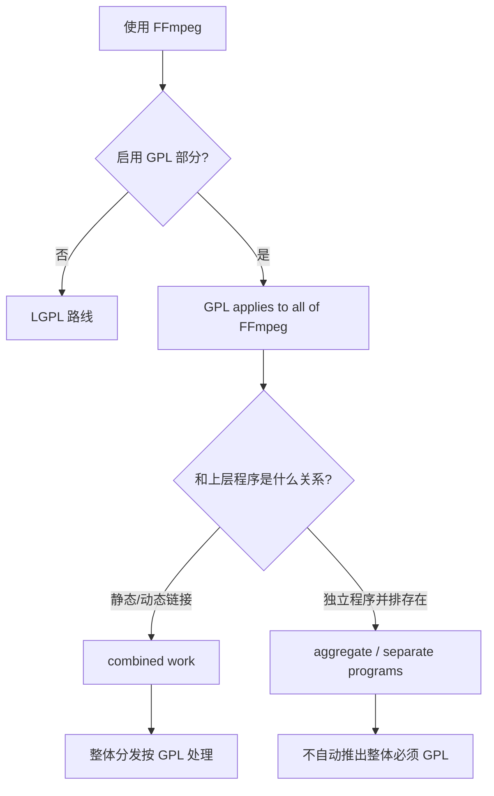
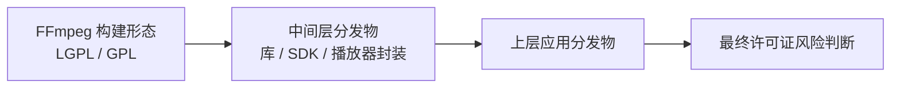

# FFmpeg 许可证边界

本文整理 FFmpeg 在 **LGPL / GPL** 两条路线下的边界，以及使用方最容易混淆的 `combined work` / `aggregate` 区别。FFmpeg 官方法律说明见 [FFmpeg legal](https://ffmpeg.org/legal.html)，GNU 对 GPL 组合物的解释见 [GNU GPL FAQ](https://www.gnu.org/licenses/gpl-faq.en.html)。

## 结论速查

| 场景 | 结论 |
|------|------|
| 默认构建，未启用 GPL 部分 | FFmpeg 仍在 LGPL 路线 |
| 启用了 GPL 部分（如 `--enable-gpl`） | `GPL applies to all of FFmpeg` |
| 静态或动态链接 GPL 库 | GNU 口径按 `combined work` 看，GPL 覆盖整个组合物分发 |
| 独立程序并排分发 | GNU 口径先看 `aggregate`，不自动等于整个项目都变 GPL |

## FFmpeg 自身的 LGPL / GPL 分界

FFmpeg 官方法律页直接说明：

> If those parts get used the GPL applies to all of FFmpeg.

因此，FFmpeg 的核心判断不是“名字叫 FFmpeg 就一定是 LGPL”，而是：

1. 是否启用了 GPL 部分
2. 是否引入了 GPL 库

同一页的 LGPL 合规清单里，官方建议：

- `Compile FFmpeg without "--enable-gpl" and without "--enable-nonfree"`
- `Use dynamic linking ... for linking with FFmpeg libraries`
- `Make sure your program is not using any GPL libraries (notably libx264).`

这意味着：

- **默认配置** 目标是留在 LGPL 路线
- **一旦启用 GPL 部分**，不能再把这套 FFmpeg 当成“普通 LGPL FFmpeg”

## GNU 对“传染性”的判断边界

“GPL 传染性”不是 GPL 条文里的正式术语，但它通常对应 GNU FAQ 对 **组合物分发** 的解释。

### linking = combined work

GNU GPL FAQ 在 [#GPLStaticVsDynamic](https://www.gnu.org/licenses/gpl-faq.en.html#GPLStaticVsDynamic) 中写道：

> Linking a GPL covered work statically or dynamically with other modules is making a combined work based on the GPL covered work. Thus, the terms and conditions of the GNU General Public License cover the whole combination.

这里最重要的点有两个：

1. **动态链接不是天然免责**
2. GNU 看的对象是 **whole combination**

### 使用 GPL 库时，整个组合物按 GPL

GNU GPL FAQ 在 [#IfLibraryIsGPL](https://www.gnu.org/licenses/gpl-faq.en.html#IfLibraryIsGPL) 中进一步写道：

> Yes, because the program actually links to the library. As such, the terms of the GPL apply to the entire combination. The software modules that link with the library may be under various GPL compatible licenses, but the work as a whole must be licensed under the GPL.

因此：

- 使用方自己的代码原本可以来自 MIT、BSD 等 GPL-compatible 许可证
- 但只要已经形成 `entire combination`，**work as a whole** 仍需按 GPL 处理

### aggregate ≠ combined work

GNU GPL FAQ 在 [#MereAggregation](https://www.gnu.org/licenses/gpl-faq.en.html#MereAggregation) 中又专门区分：

> An “aggregate” consists of a number of separate programs, distributed together on the same CD-ROM or other media.

并说明：

> The GPL permits you to create and distribute an aggregate, even when the licenses of the other software are nonfree or GPL-incompatible.

这部分决定了一个常见误区：

- **不是只要一起发，就一定整体变 GPL**
- 关键在于，GNU 认定这到底是 **single work / combined work**，还是 **aggregate**

## 常见误解

### 误解 1：动态链接一定比静态链接安全

按 GNU FAQ，**对 GPL 来说不是这样**。静态链接与动态链接都可能落入 `combined work`。

### 误解 2：上层源码仍标 MIT，就说明底层一定没用 GPL FFmpeg

不能这样推断。源码仓许可证只说明对应源码如何授权，**不能单独证明底层实际分发的 FFmpeg / libmpv 二进制一定没有 GPL 成分**。

### 误解 3：只要碰到 GPL 组件，所有情况都必须整体改 GPL

也不能这样说。GNU FAQ 明确保留了 `aggregate` 这一类情况，因此仍需判断：

- 是真正的 linking / combined work
- 还是独立程序并排存在

## 参考判断步骤

当一个程序使用 FFmpeg 时，可以按下面顺序判断：

1. **先看 FFmpeg 本身是否启用了 GPL 部分**
2. **再看上层程序与 FFmpeg 的关系是不是 linking**
3. **如果不是 linking，再判断是否更接近 aggregate**
4. **只有在 combined work 成立时，才进入“整体分发按 GPL 处理”的结论**

## 独立进程、用户自装、同包捆绑怎么判断

GNU GPL FAQ 在 [#MereAggregation](https://www.gnu.org/licenses/gpl-faq.en.html#MereAggregation) 里给出的边界，比“静态/动态链接”更细：

> Where's the line between two separate programs, and one program with two parts? We believe that a proper criterion depends both on the mechanism of communication (exec, pipes, rpc, function calls within a shared address space, etc.) and the semantics of the communication (what kinds of information are interchanged).

并继续写道：

> If the modules are included in the same executable file, they are definitely combined in one program.

以及：

> If modules are designed to run linked together in a shared address space, that almost surely means combining them into one program.

最后又补了一句对外部进程非常关键的话：

> By contrast, pipes, sockets and command-line arguments are communication mechanisms normally used between two separate programs.

但 GNU 也没有把事情说死：

> But if the semantics of the communication are intimate enough, exchanging complex internal data structures, that too could be a basis to consider the two parts as combined into a larger program.

基于这组原文，可以把常见场景拆成下面几类：

| 场景 | 更接近哪一类 | 当前更稳妥的结论 |
|------|------|------|
| 把 GPL FFmpeg 静态/动态链接进自己的程序 | `combined work` | 整体分发按 GPL 处理 |
| 用户自己单独下载 `ffmpeg`，程序通过 `exec` / 命令行参数调用 | 更接近 `separate programs` | **不能直接推出**整体项目必须 GPL |
| 安装包里同时附带一个独立 `ffmpeg` 可执行文件，运行时通过 CLI 调用 | 先按 `aggregate / separate programs` 方向评估 | **比用户自装更敏感，但也不自动等于整体必须 GPL** |
| 同一安装包里虽是独立进程，但双方交换大量内部结构、语义上高度耦合 | 可能滑向 `combined into a larger program` | 需要单独做更谨慎的法律评估 |

### 用户自装 FFmpeg

如果 FFmpeg 由用户自行安装，而上层程序只是通过：

- `exec`
- 管道
- 套接字
- 命令行参数

去调用它，那么仅按 GNU FAQ 已核到的原文，**这类通信机制通常更像两个 separate programs**，不能直接推出“整个项目必须 GPL”。

### 安装包里一起捆绑 FFmpeg

如果 GPL FFmpeg 被一起打进安装包，但仍然以 **独立可执行文件** 形式存在，那么它比“用户自装”更接近同介质分发，但 GNU FAQ 也明确允许 `aggregate`。

因此，**“同一安装包里一起发”本身，不足以自动推出整体项目必须 GPL**。仍要继续判断：

1. 是不是只是两个独立程序并排分发
2. 还是已经在技术与语义上形成单一更大的程序

### 什么时候最危险

最危险、最容易直接触发 GPL 整体覆盖的，仍然是：

- **同一可执行文件**
- **共享地址空间链接**
- **库级静态/动态链接**

因为 GNU FAQ 对这些情况的态度最明确，几乎都是朝 `combined work` 方向认定。

## 沿依赖链怎么判断

判断“FFmpeg 会不会把上层带进 GPL”时，最容易混淆的一点，是把**直接原因**和**最终结果**混在一起。

更稳妥的判断顺序是沿着依赖链一层层往上看：

### 先看中间层是否已经形成 GPL 组合物

如果某个中间层只是源码仓仍标 MIT、BSD 或 Apache，并不能单独证明它底下没有 GPL 成分；但如果 **GPL 版 FFmpeg 真是通过这条依赖链向上施加约束**，通常首先要出现的是：

- 中间层自己已经和 GPL FFmpeg 形成 `combined work`
- 或中间层自己正在分发与 GPL FFmpeg 一体化的组合物

只有这样，GPL 才会继续沿着这条分发链往上传递。

### 反过来能否据此判断上层安全

可以得到一个**有限结论**：

- **如果只看某一条特定依赖链**，而中间层并没有进入 GPL 组合分发，那么上层通常不会因为“仅仅依赖了这个上层许可证宽松的中间层”而自动被 GPL 覆盖

但这不是一个对整个应用的绝对免责结论，因为上层仍可能从其他位置再引入 GPL 组件。

### 适合直接套用的判断句

可以把这条规则压缩成一句话：

> 如果 GPL 风险是沿着某条依赖链向上传递的，那么首先要看中间层自己是否已经进入 GPL 组合分发；若中间层没有，单靠“依赖了这个中间层”本身，通常不足以推出更上层一定被 GPL 覆盖。

## 社区里最常见的解释框架

英文社区在 [MIT vs GPL license](https://stackoverflow.com/questions/3902754/mit-vs-gpl-license) 与 [GPL/LGPL and Static Linking](https://stackoverflow.com/questions/10130143/gpl-lgpl-and-static-linking) 这类讨论里，反复解释的核心点与 GNU FAQ 基本一致：MIT 是 GPL-compatible，但不是 GPL 的豁免卡；真正的焦点是 **组合物分发**。

中文社区在 [《关于FFmpeg里的GPL和LGPL协议》](https://www.codeleading.com/article/29172507216/) 这类总结文章中，也普遍围绕同样的区分来解释问题：

- FFmpeg 默认并不自动等于 GPL
- `--enable-gpl` 会改变结果
- 真正危险的是把 GPL 版构建与上层程序做成不可分的整体分发物
