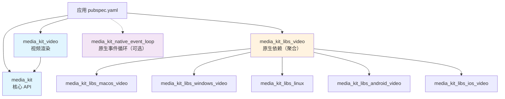

# 包结构总览

[media_kit](https://github.com/media-kit/media-kit) 是一个多包 monorepo，按职责拆分为核心包、渲染包、原生依赖包和适配器包。

## 包依赖关系



## 核心包

### media_kit

| 项 | 值 |
|----|-----|
| 版本 | ^1.2.6 |
| pub.dev | [media_kit](https://pub.dev/packages/media_kit) |
| 职责 | Player、Media、Playlist、状态管理、事件流 |
| 是否必需 | ✅ 必须 |

提供所有播放控制逻辑。通过 `dart:ffi` 绑定 libmpv，80%+ 代码在 Dart 中实现。不包含任何 UI 组件。

**何时使用：** 任何使用 media_kit 的项目都必须依赖此包。

### media_kit_video

| 项 | 值 |
|----|-----|
| 版本 | ^2.0.1 |
| pub.dev | [media_kit_video](https://pub.dev/packages/media_kit_video) |
| 职责 | VideoController、Video widget、内置视频控件 |
| 是否必需 | 仅视频渲染需要 |

提供将 Player 的视频输出渲染到 Flutter widget 树的能力。包含 `VideoController`（桥接 Player 和渲染管线）和 `Video` widget（显示画面）。

**何时使用：** 需要在 UI 中显示视频画面时。纯音频播放不需要。

### media_kit_native_event_loop

| 项 | 值 |
|----|-----|
| 版本 | ^1.0.1 |
| pub.dev | [media_kit_native_event_loop](https://pub.dev/packages/media_kit_native_event_loop) |
| 职责 | 平台原生线程处理 mpv 事件循环 |
| 是否必需 | 可选 |

解决多个 Player 实例同时运行时可能出现的 Dart VM 死锁问题。无需代码修改，添加依赖即可生效。

**何时使用：** 应用中同时存在多个 Player 实例时建议添加。Dart SDK >= 3.1 已内置 `NativeCallable`，该问题已大幅缓解。

## 原生依赖包

### 聚合包（直接依赖）

这两个包是跨平台的"伞包"，自动依赖对应平台的具体实现：

| 包 | 版本 | 包含 | 何时使用 |
|----|------|------|---------|
| `media_kit_libs_video` | ^1.0.8 | 视频 + 音频原生库 | **需要视频播放时（推荐）** |
| `media_kit_libs_audio` | ^1.0.8 | 仅音频原生库（更小体积） | 仅需音频播放时 |

> ⚠️ 两个聚合包**不可同时使用**。需要视频就选 `_video`，它同时包含音频支持。

### 平台实现包（间接依赖）

通常**不需要直接依赖**，由聚合包自动引入：

| 包 | 平台 | 视频版 | 音频版 |
|----|------|--------|--------|
| macOS | macOS 10.9+ | `media_kit_libs_macos_video` ^1.1.4 | `media_kit_libs_macos_audio` ^1.1.5 |
| Windows | Windows 7+ | `media_kit_libs_windows_video` ^1.0.12 | `media_kit_libs_windows_audio` ^1.0.10 |
| Linux | 现代发行版 | `media_kit_libs_linux` ^1.2.1 | `media_kit_libs_linux` ^1.2.1 |
| Android | Android 5.0+ | `media_kit_libs_android_video` ^1.3.8 | `media_kit_libs_android_audio` ^1.3.9 |
| iOS | iOS 9+ | `media_kit_libs_ios_video` ^1.1.4 | `media_kit_libs_ios_audio` ^1.1.4 |

> Linux 的视频和音频共用同一个包 `media_kit_libs_linux`。

每个平台实现包内含预编译的 libmpv + ffmpeg 二进制文件，通过各平台的构建系统（CocoaPods、Gradle、CMake）自动集成。

## 适配器包

### video_player_media_kit

| 项 | 值 |
|----|-----|
| 版本 | ^2.0.0 |
| pub.dev | [video_player_media_kit](https://pub.dev/packages/video_player_media_kit) |
| 职责 | Flutter 官方 `video_player` 接口的 media_kit 后端实现 |
| 是否必需 | 不需要 |

将 media_kit 包装为 `video_player_platform_interface` 的实现，使已有的 `video_player` 代码无需修改即可使用 media_kit 后端。

**何时使用：** 已有项目使用 Flutter 官方 `video_player`，想替换后端但不改 API 调用时。新项目直接使用 `media_kit` + `media_kit_video` 即可，不需要此适配器。

## 典型依赖配置

### 视频播放（标准配置）

```yaml
dependencies:
  media_kit: ^1.2.6
  media_kit_video: ^2.0.1
  media_kit_libs_video: ^1.0.8
```

### 视频播放 + 多实例

```yaml
dependencies:
  media_kit: ^1.2.6
  media_kit_video: ^2.0.1
  media_kit_libs_video: ^1.0.8
  media_kit_native_event_loop: ^1.0.1
```

### 纯音频播放

```yaml
dependencies:
  media_kit: ^1.2.6
  media_kit_libs_audio: ^1.0.8
```

### 替换 video_player 后端

```yaml
dependencies:
  video_player: ^latest
  video_player_media_kit: ^2.0.0
  media_kit: ^1.2.6
  media_kit_video: ^2.0.1
  media_kit_libs_video: ^1.0.8
```
