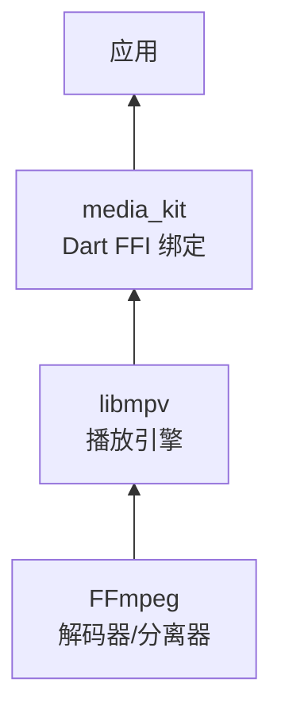
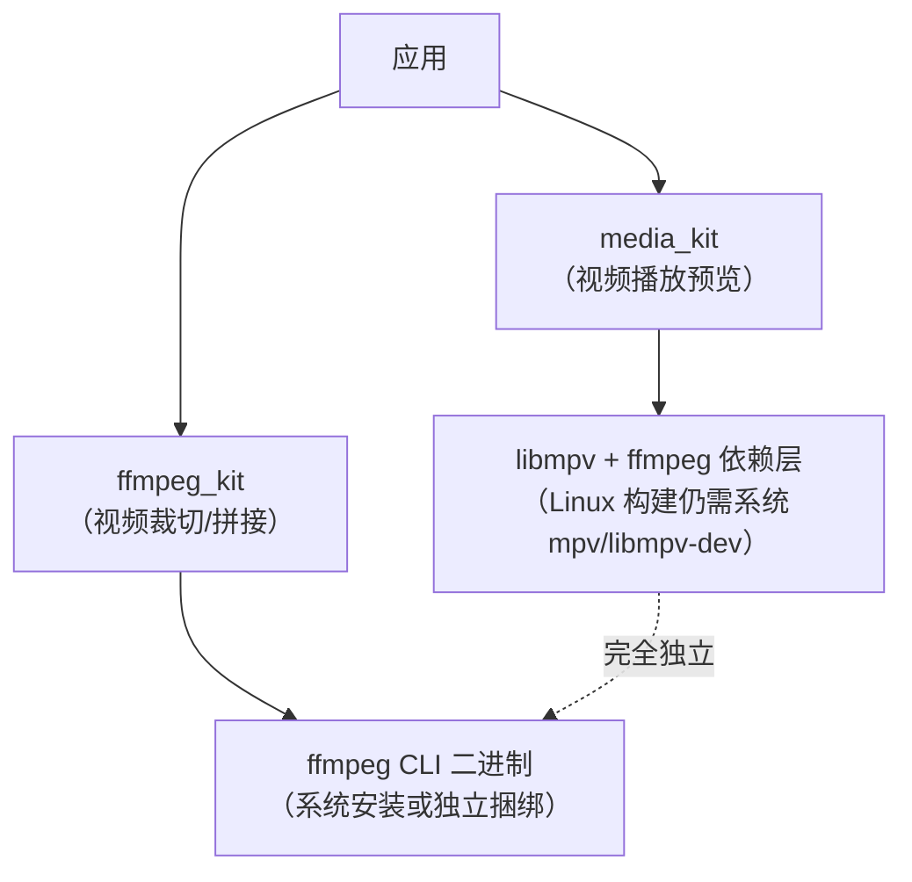

# 注意事项

## 许可证

| 组件 | 许可证 | 说明 |
|------|--------|------|
| media_kit（Dart 代码） | MIT | 无限制 |
| libmpv | LGPL-2.1 | 动态链接（FFI）满足 LGPL 要求 |
| ffmpeg | LGPL-2.1（默认构建） | 同上 |

LGPL 合规要点：
- media_kit 通过 `dart:ffi` 动态链接 libmpv，不静态编译进应用
- 用户可以替换捆绑的 libmpv/ffmpeg 库
- **无需公开应用源码**，但需声明使用了 LGPL 库

## 后端

后端是 [libmpv](https://github.com/mpv-player/mpv/tree/master/libmpv)（mpv 播放器的库形式）。mpv 本身基于 ffmpeg。



> media_kit 架构文档注明未来可能支持其他后端（[README Implementation 章节](https://github.com/media-kit/media-kit#implementation)）。

## 80%+ Dart FFI

核心播放逻辑（80%+）在 Dart 中通过 FFI 实现：

| 层 | 实现 | 说明 |
|----|------|------|
| 播放控制 | Dart FFI | open/play/pause/seek/volume/rate 等 |
| 事件处理 | Dart FFI + Isolate | mpv_wait_event 循环在后台 Isolate |
| 状态管理 | Dart Stream | 所有状态通过 StreamController 暴露 |
| 视频渲染 | 平台原生代码 | 唯一需要平台特定实现的部分 |

事件处理使用 Isolate 运行 `mpv_wait_event` 事件轮询，通过 `ReceivePort` 将事件地址传回主 Isolate 解析。Dart 3.1+ 可用 `NativeCallable` 替代。

## 性能

- Release 模式性能**远高于** Debug 模式
- 硬件加速默认开启
- Android 建议启用 `--split-per-abi` 减小 APK 体积

## 默认 mpv 属性

media_kit 在 `_create()` 中设置的[完整默认属性](https://github.com/media-kit/media-kit/blob/main/media_kit/lib/src/player/native/player/real.dart)：

| 属性 | 值 | 说明 |
|------|-----|------|
| `idle` | `yes` | 空闲时保持活跃 |
| `pause` | `yes` | 初始暂停状态 |
| `keep-open` | `yes` | EOF 不自动关闭 |
| `audio-display` | `no` | 禁用音频可视化 |
| `network-timeout` | `5` | 网络超时 5 秒 |
| `cache` | `yes` | 启用缓存 |
| `cache-on-disk` | `yes` | 磁盘缓存 |
| `hr-seek` | `yes` | 精确 seek |
| `hr-seek-framedrop` | `no` | seek 时不丢帧 |
| `scale` | `bilinear` | 缩放算法 |
| `subs-fallback` | `yes` | 字幕回退 |

## 已知问题与限制

| 问题 | 说明 | 状态 |
|------|------|------|
| macOS 架构文档缺失 | README 中 macOS 渲染部分标记为 "TODO" | 代码可用，文档未写 |
| 多实例死锁 | 超过一定数量的 Player 实例可能导致 Dart VM 死锁 | 添加 `media_kit_native_event_loop` 包解决；Dart 3.1+ 已修复 |
| Web 支持 | 使用 HTML5 video/audio 元素，非 libmpv | 功能受浏览器限制 |

## 与项目的集成考量

### seek 精度

media_kit [默认设置](https://github.com/media-kit/media-kit/blob/main/media_kit/lib/src/player/native/player/real.dart) `hr-seek=yes` 和 `hr-seek-framedrop=no`，即**默认启用精确到帧的 seek**。

这一点从源码 `_create()` 方法的默认属性列表中确认：

```dart
// media_kit 默认设置（已包含）
'hr-seek': 'yes',
'hr-seek-framedrop': 'no',
```

> 无需额外配置，seek 已经是精确模式。对于裁切场景非常有利。

如需调整为 keyframe seek（更快但不精确）：

```dart
final native = player.platform as NativePlayer;
await native.setProperty('hr-seek', 'no');
```

### 包体积

捆绑 libmpv + ffmpeg 解码器会增加包体积。具体取决于平台和编译选项，桌面端约 20-40MB。

### 与现有 ffmpeg 子进程方案共存

media_kit 内部的 ffmpeg 是 libmpv 的依赖（用于解码），与应用通过子进程调用的 ffmpeg CLI 工具**完全独立**，不冲突。


