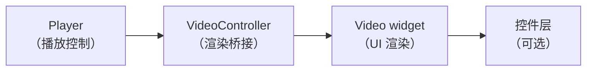
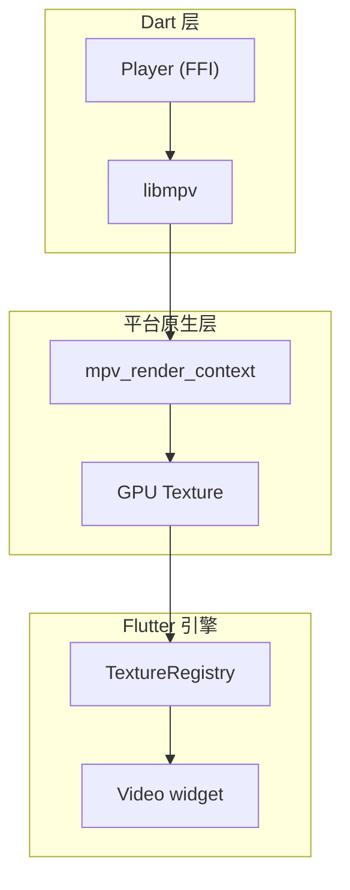

# 视频渲染

## 架构



Player 负责解码，VideoController 负责连接 Player 和渲染管线，Video widget 负责显示。

## VideoController

连接 Player 和 Video widget 的桥梁。

```dart
final player = Player();
final controller = VideoController(player);

// 带配置
final controller = VideoController(
  player,
  configuration: VideoControllerConfiguration(
    enableHardwareAcceleration: true,  // 默认 true
    width: 1920,   // 指定渲染宽度（null 为自动）
    height: 1080,  // 指定渲染高度（null 为自动）
  ),
);
```

| 参数 | 默认 | 说明 |
|------|------|------|
| `enableHardwareAcceleration` | `true` | GPU 硬件加速 |
| `width` | `null` | 渲染宽度（null = 跟随视频原始分辨率） |
| `height` | `null` | 渲染高度 |

## Video widget

显示视频画面的 Flutter widget。

```dart
Video(
  controller: controller,
  // 常用参数：
  width: 640,
  height: 360,
  fit: BoxFit.contain,          // 视频适应方式
  fill: Colors.black,           // 黑边填充色
  controls: NoVideoControls,    // 禁用内置控件
  wakelock: true,               // 防止屏幕休眠（默认 true）
  pauseUponEnteringBackgroundMode: true,  // 后台暂停
)
```

### 普通播放器最小组合

```dart
final player = Player();
await player.open(Media('/path/to/video.mp4'), play: false);
final controller = VideoController(player);

AspectRatio(
  aspectRatio: 16 / 9,
  child: Video(
    controller: controller,
    controls: AdaptiveVideoControls,
    fit: BoxFit.contain,
    fill: Colors.black,
  ),
)
```

这种组合适合信息页、详情页之类的“默认显示预览，由用户手动开始播放”的普通播放器。

### 控件类型

| 类型 | 说明 |
|------|------|
| `AdaptiveVideoControls` | 根据平台自动选择（默认） |
| `MaterialVideoControls` | Material Design 风格 |
| `MaterialDesktopVideoControls` | Material Design 桌面风格 |
| `CupertinoVideoControls` | iOS 风格 |
| `NoVideoControls` | 不显示控件 |
| 自定义 `builder` | 完全自定义控件 UI |

### 自定义控件

```dart
Video(
  controller: controller,
  controls: (VideoState state) {
    // state.widget.controller 访问 VideoController
    // state.widget.controller.player 访问 Player
    return Stack(
      children: [
        // 自定义播放按钮
        Positioned(
          bottom: 16,
          left: 16,
          child: IconButton(
            icon: Icon(Icons.play_arrow),
            onPressed: () => state.widget.controller.player.playOrPause(),
          ),
        ),
      ],
    );
  },
)
```

### 全屏

内置控件支持全屏，也可手动触发：

```dart
// 进入全屏
await defaultEnterNativeFullscreen();

// 退出全屏
await defaultExitNativeFullscreen();
```

## 渲染原理（平台差异）

所有桌面平台使用 Flutter Texture API（非 PlatformView），视频帧通过 GPU 纹理传递：



| 平台 | 渲染 API | 说明 |
|------|----------|------|
| Windows | ANGLE (EGL) + D3D11 | mpv_render_context 渲染到 D3D11 纹理 |
| macOS | OpenGL / Metal | 通过 Flutter Texture API |
| Linux | OpenGL (TextureGL / TextureSW) | 优先 GL，回退软件渲染 |
| Android | SurfaceTexture + mediacodec | 硬件解码直接渲染 |
| iOS | CVPixelBuffer | 通过 Flutter Texture API |

### Texture 方案的优势

与 PlatformView 相比：

| 特性 | Texture | PlatformView |
|------|---------|-------------|
| Flutter 控件可叠加 | ✅ | ❌ |
| Z 轴自由 | ✅ | ❌ |
| 性能 | ✅ GPU 直通 | ⚠️ Hybrid Composition 开销 |
| 手势处理 | ✅ Flutter 正常处理 | ⚠️ 需要转发 |
| 动画 | ✅ 可参与 Flutter 动画 | ❌ |

## 字幕

```dart
// 内置字幕自动显示
// 样式自定义：
Video(
  controller: controller,
  subtitleViewConfiguration: SubtitleViewConfiguration(
    style: TextStyle(
      fontSize: 24.0,
      color: Colors.white,
      backgroundColor: Color(0xaa000000),
    ),
    textAlign: TextAlign.center,
    padding: EdgeInsets.all(24.0),
  ),
)
```
