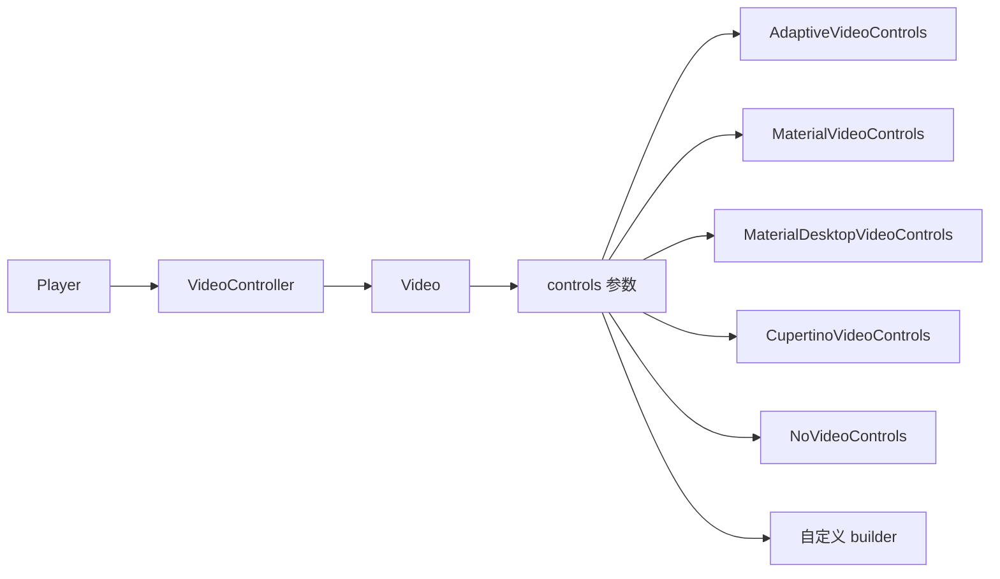

# 默认播放控件

`media_kit_video` 在官方 README 与导出层中都提供了可直接使用的内置 controls，[README](https://github.com/media-kit/media-kit/blob/main/README.md) 给出了 `Video(..., controls: ...)` 的直接示例，对外导出层则明确暴露了 `AdaptiveVideoControls`、`MaterialVideoControls`、`MaterialDesktopVideoControls`、`CupertinoVideoControls`、`NoVideoControls` 等入口。

## 控件层关系



内置控件层是挂在 `Video` 的 `controls` 参数上的。也就是说，普通播放器并不需要自己先写工具栏，只要把合适的 controls 类型传进去即可。

## 默认选择规则

`AdaptiveVideoControls` 的平台分发逻辑来自 [adaptive.dart](https://github.com/media-kit/media-kit/blob/main/media_kit_video/lib/media_kit_video_controls/src/controls/adaptive.dart)：

| 平台 | 默认控件 |
|------|----------|
| Android / iOS | `MaterialVideoControls` |
| macOS / Windows / Linux | `MaterialDesktopVideoControls` |
| 其他平台兜底 | `NoVideoControls` |

因此，在桌面端做一个普通播放器时，直接用 `AdaptiveVideoControls` 通常就够了。

## 普通播放器最小接线

```dart
final player = Player();
await player.open(Media('/path/to/video.mp4'), play: false);

final controller = VideoController(player);

Video(
  controller: controller,
  controls: AdaptiveVideoControls,
  fit: BoxFit.contain,
  fill: Colors.black,
)
```

这套接线已经覆盖了普通播放器最核心的几层：

| API / 参数 | 作用 |
|------------|------|
| `Player()` | 创建播放核心对象 |
| `Media('/path/to/video.mp4')` | 描述媒体资源 |
| `player.open(..., play: false)` | 打开媒体但默认不自动播放 |
| `VideoController(player)` | 把 `Player` 接到渲染层 |
| `Video(controller: ..., controls: AdaptiveVideoControls)` | 显示画面并启用内置完整工具栏 |
| `fit: BoxFit.contain` | 保持完整画面，不裁切内容 |
| `fill: Colors.black` | 给留黑边区域提供统一填充色 |

## `Video` 上与普通播放器最常见的参数

```dart
Video(
  controller: controller,
  controls: AdaptiveVideoControls,
  fit: BoxFit.contain,
  fill: Colors.black,
  wakelock: true,
  pauseUponEnteringBackgroundMode: true,
)
```

| 参数 | 常见值 | 说明 |
|------|--------|------|
| `controller` | `VideoController` | 必填，连接 `Player` 与 `Video` |
| `controls` | `AdaptiveVideoControls` 等 | 选择内置或自定义工具栏 |
| `fit` | `BoxFit.contain` 等 | 视频缩放方式 |
| `fill` | `Colors.black` 等 | 黑边或空白区域填充色 |
| `wakelock` | `true` / `false` | 播放时是否阻止休眠 |
| `pauseUponEnteringBackgroundMode` | `true` / `false` | 进入后台时是否自动暂停 |

## 内置控件类型

| 类型 | 适用场景 |
|------|----------|
| `AdaptiveVideoControls` | 想按平台自动选择，优先推荐 |
| `MaterialVideoControls` | 移动端 Material 风格 |
| `MaterialDesktopVideoControls` | 桌面端 Material 风格 |
| `CupertinoVideoControls` | 明确需要 iOS 风格时使用 |
| `NoVideoControls` | 只显示画面，不要工具栏 |
| 自定义 `builder` | 工具栏要完全自定义时使用 |

## 什么时候不用默认控件

默认控件适合“普通播放器”场景；如果页面需要强业务约束，就应考虑不用它：

- 需要把按钮状态和业务状态机强绑定
- 需要禁用或重排大量默认交互
- 需要和外部滑块、关键帧逻辑、时间吸附逻辑联动

这类场景更适合 `NoVideoControls` 或自定义 `builder`，而不是勉强改默认工具栏。
