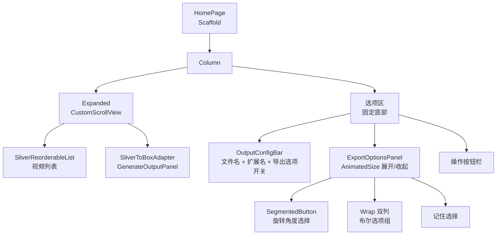
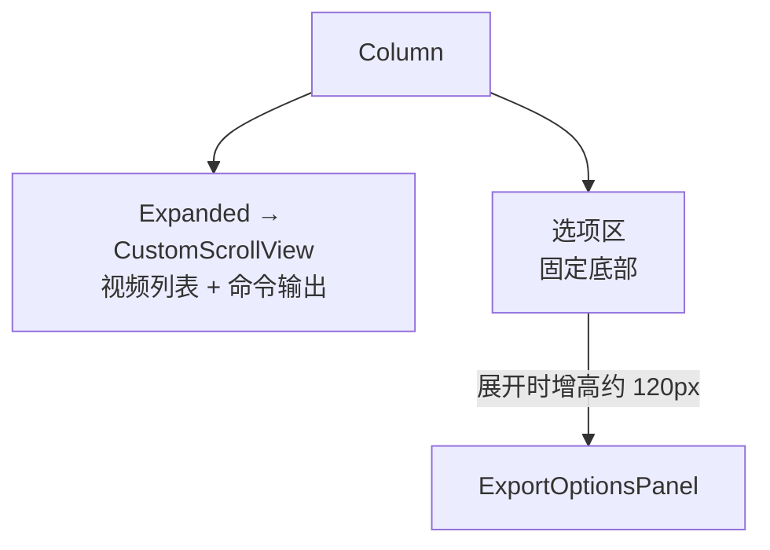
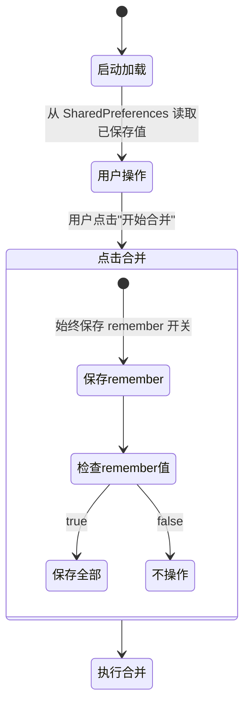

# 导出选项设计

本文档描述导出选项功能的完整设计。FFmpeg 参数细节见 [md/参考/FFmpeg/无损处理参数.md](../../参考/FFmpeg/无损处理参数.md)。

## 功能概述

在主页底部新增可展开的导出选项面板，提供无损处理选项和「记住选择」功能。所有选项基于 FFmpeg stream copy，不涉及重编码。

## 选项清单

| 选项 | 控件类型 | 默认值 | FFmpeg 参数 | 约束 |
|------|----------|--------|-------------|------|
| 文件名 | 文本输入 | 自动生成 | 输出路径 | 已有功能 |
| 扩展名 | 下拉选择 | mp4 | 容器格式 | 已有功能 |
| 旋转 | 分段按钮 | 0° | `-display_rotation:v:0 X`（输入选项） | 仅元数据旋转，需 FFmpeg ≥ 6.0 |
| 去除音频 | 复选框 | 关 | `-an` | 与 `-acodec copy` 互斥 |
| 去除字幕 | 复选框 | 关 | `-sn` | |
| 快速启动 | 复选框 | 关 | `-movflags +faststart` | 仅 mp4/mov 可用 |
| 清除元数据 | 复选框 | 关 | `-map_metadata -1` | |
| 拼接点章节 | 复选框 | 关 | FFMETADATA1 注入 | 需 ffprobe 获取时长 |
| 记住选择 | 复选框 | 关 | 无 | 控制持久化行为 |

## UI 布局

### 整体结构

选项区固定在页面底部，不随视频列表滚动。完整布局架构见 [架构设计.md](架构设计.md) 的「主页布局架构」章节。

```
┌─ HomePage ────────────────────────────────────────┐
│  AppBar                                           │
├═══════════════════════════════════════════════════┤
│  ┌─ CustomScrollView (Expanded) ───────────────┐  │
│  │  视频列表（SliverReorderableList）           │  │
│  │  命令输出面板（条件显示，跟随列表滚动）       │  │
│  └─────────────────────────────────────────────┘  │
├─ 选项区 (固定底部) ──────────────────────────────┤
│  [文件名______] . [mp4 ▼]  ≈ 2.1GB  [☑ 导出选项] │
│  ┌─ ExportOptionsPanel（展开时显示）───────────┐  │
│  │  旋转:  (•)无  ( )0°  ( )90°  ( )180° ( )270° │
│  │  ☐ 去除音频    ☐ 去除字幕                   │  │
│  │  ☐ 快速启动    ☐ 清除元数据                  │  │
│  │  ☐ 拼接点章节               ☐ 记住选择       │  │
│  └─────────────────────────────────────────────┘  │
│  [+ 添加视频]                    [▶ 开始合并] [⏹] │
└───────────────────────────────────────────────────┘
```

### 组件关系



### 控件选择

| 控件 | 用途 | 说明 |
|------|------|------|
| `SegmentedButton<int>` | 旋转角度 | Material 3 分段按钮，4 选 1 |
| `Checkbox` + `Wrap` | 布尔选项 | 双列自适应，固定宽度 180px |
| `AnimatedSize` | 展开动画 | 200ms easeInOut |

## 滚动策略



- 选项区（OutputConfigBar + ExportOptionsPanel + 操作按钮）始终固定在页面底部，不参与滚动
- 视频列表与命令输出面板在同一个 `CustomScrollView` 中滚动
- 展开/收起导出选项使用 `AnimatedSize` 平滑过渡，滚动区域自动缩放

## 交互行为

### 选项联动

| 条件 | 行为 |
|------|------|
| 扩展名为 mp4/mov | 「快速启动」可用 |
| 扩展名为其他 | 「快速启动」灰显 + Tooltip 提示 |
| 切换到不支持的扩展名 | 自动取消「快速启动」并灰显 |
| 生成中 | 所有选项禁用 |

### 记住选择



**保存时机**：仅在点击「开始合并」时触发。

**启动加载**：每次启动从 SharedPreferences 加载已保存值。未保存过的键使用默认值。

**remember 开关本身**：每次合并都保存（无论 true 或 false）。

**remember = true**：保存所有导出选项当前值。

**remember = false**：不保存、不修改、不删除已有值。下次启动仍使用上次保存的值。

## 数据模型

### ExportOptions

| 字段 | 类型 | 默认值 | 说明 |
|------|------|--------|------|
| showOptions | bool | false | 面板展开状态 |
| rotation | int | 0 | 旋转角度 |
| removeAudio | bool | false | 去除音频 |
| removeSubtitles | bool | false | 去除字幕 |
| fastStart | bool | false | 快速启动 |
| stripMetadata | bool | false | 清除元数据 |
| addChapters | bool | false | 拼接点章节 |
| rememberChoices | bool | false | 记住选择 |

ExportOptions 提供 `toFFmpegArgs(outputExtension)` 方法，将当前选项转换为 FFmpeg 参数列表。

### 章节构建

当 `addChapters` 为 true 时，合并前通过 ffprobe 逐个获取每个视频时长，生成 FFMETADATA1 格式章节文件。章节标题使用视频文件名（去除扩展名）。任一视频探测失败则跳过章节注入。

## 持久化

### SharedPreferences 键

| 键名 | 类型 | 说明 |
|------|------|------|
| `export_remember` | bool | 总开关，始终保存 |
| `export_show_options` | bool | 面板展开状态 |
| `export_rotation` | int | 旋转角度 |
| `export_remove_audio` | bool | 去除音频 |
| `export_remove_subtitles` | bool | 去除字幕 |
| `export_fast_start` | bool | 快速启动 |
| `export_strip_metadata` | bool | 清除元数据 |
| `export_add_chapters` | bool | 拼接点章节 |

### 读写逻辑

- **加载**：启动时读取所有已保存键值，未找到的键使用默认值
- **保存**：仅在合并时触发；`export_remember` 始终保存，其余键仅在 `export_remember = true` 时保存

## 文件结构

| 文件 | 职责 |
|------|------|
| `models/export_options.dart` | ExportOptions 数据模型 |
| `views/home/widgets/export_options_panel.dart` | 展开面板 UI |
| `views/home/widgets/output_config_bar.dart` | 输出配置栏（含导出选项开关） |
| `utils/chapter_builder.dart` | 章节构建辅助函数 |
| `repositories/preferences_repository.dart` | 导出选项持久化 |
| `view_models/home_viewmodel.dart` | 状态管理 + 选项更新 |
| `ffmpeg_kit/video_concat_service.dart` | 接收额外参数 + 章节元数据 |
