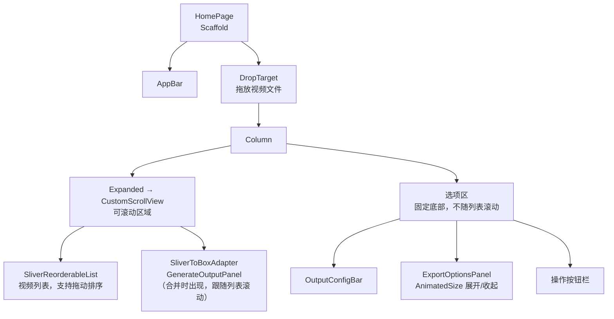

# 视频合并工具 - 架构设计

## 概述

基于 MVVM 架构的视频合并工具，核心功能是将多个视频文件按顺序合并为一个输出文件。

## 模块划分

| 模块 | 职责 |
|------|------|
| 主页模块 | 视频列表管理、排序、导出选项、生成操作 |
| 设置模块 | FFmpeg 路径配置 |
| FFmpeg 模块 | 命令执行、进程管理、章节生成 |
| 持久化模块 | 用户偏好存储（后缀、FFmpeg 路径、导出选项） |

> 导出选项功能的完整设计见 [导出选项设计.md](导出选项设计.md)。

## 数据流

```
用户操作 → View → ViewModel → Service/Repository
                      ↓
状态更新 ← View ← ViewModel ← Service/Repository
```

---

## 主页模块

### 核心实体

```dart
/// 视频项
class VideoItem {
  final String id;
  final String filePath;
  final String fileName;
  final int fileSize;
}

/// 输出配置
class OutputConfig {
  final String baseName;
  final String extension;
  
  String get fullName => '$baseName.$extension';
}

/// 导出选项（详见 导出选项设计.md）
class ExportOptions {
  final bool showOptions;
  final int rotation;
  final bool removeAudio;
  final bool removeSubtitles;
  final bool fastStart;
  final bool stripMetadata;
  final bool addChapters;
  final bool rememberChoices;
}

/// 生成状态
enum GenerateState {
  idle,
  running,
  success,
  failed,
  cancelled,
}

/// 生成结果
class GenerateResult {
  final GenerateState state;
  final String output;
  final String? errorMessage;
}
```

### ViewModel 接口

```dart
/// 主页 ViewModel 契约
abstract class IHomeViewModel {
  List<VideoItem> get videoItems;
  OutputConfig get outputConfig;
  ExportOptions get exportOptions;
  GenerateResult? get generateResult;
  bool get isGenerating;
  
  void addVideos(List<String> filePaths);
  void removeVideo(String id);
  void reorderVideo(int oldIndex, int newIndex);
  void updateOutputBaseName(String baseName);
  void updateOutputExtension(String extension);
  void updateExportOptions(ExportOptions options);
  Future<void> startGenerate(String outputPath);
  void cancelGenerate();
  void clearResult();
  void reset();
}
```

### View 交互规范

| 操作 | 行为 | 确认 |
|------|------|------|
| 添加视频 | 点击按钮或拖放文件 | 无 |
| 删除视频 | 点击删除按钮 | 无 |
| 拖动排序 | 拖动专用拖动手柄 | 无 |
| 修改文件名 | 直接编辑输入框 | 无 |
| 修改后缀 | 直接编辑/选择 | 无，自动保存 |
| 展开/收起导出选项 | 勾选/取消「导出选项」复选框 | 无 |
| 修改导出选项 | 直接操作各控件 | 无 |
| 确认生成 | 点击生成按钮 → 选择保存路径 | 保存对话框 |
| 中断生成 | 点击取消按钮 | 无 |

### 主页布局架构

主页采用「固定底部 + 滚动区域」的布局模式。



整体 ASCII 布局：

```
┌─ Scaffold ────────────────────────────────────────┐
│  AppBar: 视频合并          [🔄 新任务] [⚙ 设置]  │
├═══════════════════════════════════════════════════┤
│  ┌─ CustomScrollView (Expanded) ───────────────┐  │
│  │                                             │  │
│  │  ┌─ SliverReorderableList ────────────────┐ │  │
│  │  │  ⋮⋮  video_001.mp4            [删除]   │ │  │
│  │  │  ⋮⋮  video_002.mp4            [删除]   │ │  │
│  │  │  ⋮⋮  video_003.mp4            [删除]   │ │  │
│  │  └────────────────────────────────────────┘ │  │
│  │                                             │  │
│  │  ┌─ GenerateOutputPanel (条件显示) ────────┐ │  │
│  │  │  🔄 正在合并...                         │ │  │
│  │  │  ┌─ 终端输出区 (200px, 独立滚动) ────┐ │ │  │
│  │  │  │  ffmpeg -i input1.mp4 ...         │ │ │  │
│  │  │  │  frame= 1024 fps=60 ...           │ │ │  │
│  │  │  └───────────────────────────────────┘ │ │  │
│  │  └────────────────────────────────────────┘ │  │
│  │                                             │  │
│  └─────────────────────────────────────────────┘  │
├─ 选项区 (固定底部) ──────────────────────────────┤
│  输出: [merged_video] . [mp4 ▼]  ≈ 2GB [☑选项]  │
│  ┌─ ExportOptionsPanel (展开时显示) ───────────┐  │
│  │  旋转 / 去除音频 / 字幕 / 快速启动 / ...   │  │
│  └─────────────────────────────────────────────┘  │
│  [+ 添加视频]                    [▶ 开始合并] [⏹] │
└───────────────────────────────────────────────────┘
```

#### 设计要点

| 要点 | 说明 |
|------|------|
| 选项区固定底部 | 选项区在 `Column` 中位于 `Expanded` 之后，始终可见不滚动 |
| 命令输出跟随列表 | `GenerateOutputPanel` 作为 `SliverToBoxAdapter` 放在列表末尾，与视频列表同一滚动区域 |
| 终端区独立滚动 | 面板内的黑色终端区域使用 `SingleChildScrollView(reverse: true)` 独立滚动，固定高度 200px |
| 自动滚动 | 开始合并时自动滚动到命令输出面板位置 |
| 空状态占位 | 无视频且无输出时显示拖放提示占位符，替代 `CustomScrollView` |
| 拖动排序代理 | `SliverReorderableList` 需自定义 `proxyDecorator`，用 `Material(elevation)` 包裹拖动中的项 |

#### 命令输出面板状态

| 状态 | 背景色 | 图标 | 标题 |
|------|--------|------|------|
| running | primaryContainer | ⏳ | 正在合并... |
| success | tertiaryContainer | ✅ | 合并完成 |
| failed | errorContainer | ❌ | 合并失败 |
| cancelled | surfaceContainerHighest | 🚫 | 已取消 |

面板仅在 `generateResult != null` 时显示，合并失败时额外显示错误信息。

### 列表项布局

```
┌─────────────────────────────────────────────────────────┐
│ ⋮⋮  video_001.mp4                        ⚠️    [删除] │
│     1.2 GB · /path/to/file                              │
└─────────────────────────────────────────────────────────┘
  ↑                                         ↑        ↑
拖动手柄                              兼容性警告  删除按钮
```

| 视觉提示 | 条件 | 表现 |
|----------|------|------|
| 红色文件名 | 当前项文件名排序在前一项之前 | 提示乱序 |
| ⚠️ 警告图标 | 编码参数与第一个视频不一致 | 提示可能合并失败 |
| 点击跳转 | 点击列表项 | 跳转视频详情页，不一致时携带参考视频路径 |

### 输出配置区域

```
┌─────────────────────────────────────────────────────────────┐
│ 输出: [  merged_video  ] . [ mp4 ▼]  ≈ 2GB  [☑ 导出选项]  │
├─────────────────────────────────────────────────────────────┤
│  旋转: (•)无 ( )0° ( )90° ( )180° ( )270°                  │
│  ☐ 去除音频  ☐ 去除字幕  ☐ 快速启动(mp4)                   │
│  ☐ 清除元数据  ☐ 拼接点章节           ☐ 记住选择            │
└─────────────────────────────────────────────────────────────┘
         ↑ 展开面板（AnimatedSize 动画，200ms）
```

---

## 设置模块

### 实体

```dart
/// 应用设置
class AppSettings {
  final String ffmpegPath;
  
  AppSettings({
    required this.ffmpegPath,
  });
}
```

### ViewModel 接口

```dart
/// 设置 ViewModel 契约
abstract class ISettingsViewModel {
  /// 当前设置
  AppSettings get settings;
  
  /// FFmpeg 路径是否有效
  bool get isFFmpegValid;
  
  /// 更新 FFmpeg 路径
  Future<void> updateFFmpegPath(String path);
  
  /// 验证 FFmpeg 路径
  Future<bool> validateFFmpegPath(String path);
  
  /// 浏览选择 FFmpeg 路径
  Future<void> browseFFmpegPath();
}
```

---

## FFmpeg 模块

### 服务接口

```dart
/// FFmpeg 执行回调
typedef OutputCallback = void Function(String output);

/// FFmpeg 服务契约
abstract class IFFmpegService {
  /// 设置 FFmpeg 可执行文件路径
  set ffmpegPath(String path);
  
  /// 验证 FFmpeg 是否可用
  Future<bool> validate();
  
  /// 执行原始命令
  /// [arguments] 命令参数列表
  /// [onOutput] 实时输出回调
  /// 返回退出码
  Future<int> execute({
    required List<String> arguments,
    OutputCallback? onOutput,
  });
  
  /// 中断当前执行
  void cancel();
  
  /// 是否正在执行
  bool get isRunning;
}

/// 视频合并服务契约
abstract class IVideoConcatService {
  /// 合并视频文件
  Future<int> concat({
    required List<String> inputPaths,
    required String outputPath,
    List<String> extraArguments = const [],
    List<ChapterInfo>? chapters,
    OutputCallback? onOutput,
  });
  
  void cancel();
}
```

---

## 持久化模块

### Repository 接口

```dart
/// 用户偏好存储契约
abstract class IPreferencesRepository {
  Future<String> getLastExtension();
  Future<void> saveLastExtension(String extension);
  Future<String?> getFFmpegPath();
  Future<void> saveFFmpegPath(String path);
  Future<ExportOptions> loadExportOptions();
  Future<void> saveExportOptions(ExportOptions options);
}
```

---

## 自动生成输出文件名规则

| 条件 | 生成规则 |
|------|----------|
| 无视频 | 空 |
| 单个视频 | `{视频文件名}_merged` |
| 多个视频 | `{首个视频文件名}_merged` |

后缀默认使用持久化存储的值，首次使用时默认为 `mp4`。
