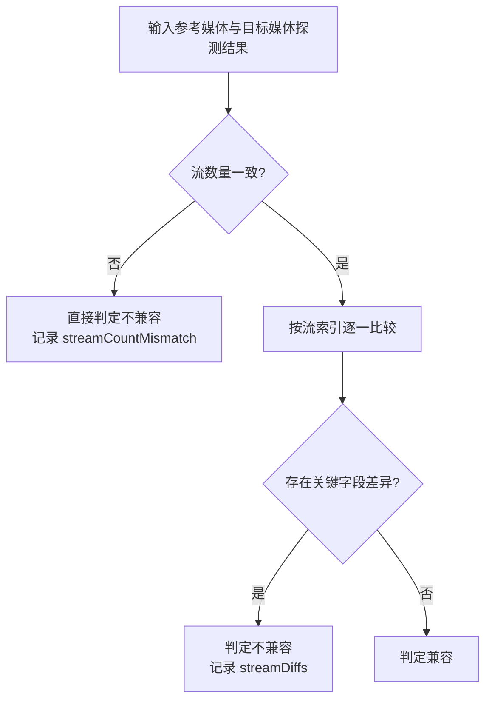

# 兼容性判定设计

## 目标

兼容性判定用于回答一个明确问题：

> 两份媒体文件能否在**不重新编码**前提下直接参与同一条合并链路。

这里判断的是**可直接拼接的技术兼容性**，不是“播放器大概率能播”的宽松兼容性。

## 基本原则

1. **以无损拼接为前提**
2. **以参考文件为基准逐项比较**
3. **只要存在会破坏直接拼接的关键差异，就判定为不兼容**
4. **结果必须可解释**，不能只给布尔值

## 输入与输出

### 输入

- 参考媒体的探测结果
- 目标媒体的探测结果

探测结果至少应包含：

- 流列表
- 每条流的类型
- 与直接拼接相关的关键编码参数

### 输出

兼容性判定结果至少包含：

| 字段 | 含义 |
|------|------|
| `isCompatible` | 是否可直接参与无损拼接 |
| `streamCountMismatch` | 流数量不一致时的高优先级结论 |
| `streamDiffs` | 每条流的差异详情 |

## 判定流程

## 比较粒度

### 第一层：流数量

流数量不一致时，直接判定不兼容。

原因：

- 无损拼接要求流结构稳定
- 流数量变化会导致映射关系不稳定
- 这种差异优先级高于单字段差异

### 第二层：流顺序

默认按**流索引顺序**比较，而不是按“同类型流集合”重配对。

原因：

- 无损拼接链路依赖稳定的流布局
- 一旦允许重配对，就会把“结构不同”误判成“只是顺序不同”
- 第一版应优先保证保守正确，而不是放宽兼容范围

### 第三层：按流类型比较关键字段

#### 视频流

视频流至少比较：

| 字段 | 作用 |
|------|------|
| `codecName` | 编码器必须一致 |
| `profile` | profile 差异可能导致无法直接拼接 |
| `width` / `height` | 分辨率必须一致 |
| `pixFmt` | 像素格式必须一致 |
| `frameRate` | 帧率差异会破坏时序一致性 |
| `colorRange` | 色彩范围差异会改变显示语义 |
| `colorSpace` | 色彩空间差异会改变解码语义 |
| `colorTransfer` | 传输特性差异会影响 SDR/HDR 语义 |
| `colorPrimaries` | 色域原色差异会影响颜色解释 |

#### 音频流

音频流至少比较：

| 字段 | 作用 |
|------|------|
| `codecName` | 编码器必须一致 |
| `profile` | profile 差异可能导致位流不兼容 |
| `sampleRate` | 采样率必须一致 |
| `channels` | 声道数必须一致 |
| `channelLayout` | 声道布局必须一致 |

#### 其他流

无论流类型是什么，至少比较：

| 字段 | 作用 |
|------|------|
| `codecType` | 流类型本身变化必须算差异 |

第一版对非音视频流采取保守策略：

- 不做深度字段放宽
- 只要结构或类型不一致，就维持不兼容结论

## 差异记录原则

差异记录必须满足：

1. **逐流记录**
2. **逐字段记录**
3. 同时保留参考值和目标值

推荐结构：

| 层级 | 内容 |
|------|------|
| 顶层 | 是否兼容、流数量不匹配说明 |
| 流级 | `index`、`codecType` |
| 字段级 | `fieldName -> (referenceValue, targetValue)` |

## 判定风格

兼容性判定应当采用**保守判定**：

- 宁可把边界情况判成“不兼容”，也不要把需要重编码的输入误放进无损合并
- 放宽规则必须建立在明确验证之上，而不能靠猜测

## 与 UI 的关系

兼容性结果主要服务两类界面：

| 场景 | 用法 |
|------|------|
| 主页面列表 | 只消费布尔结果，快速标记兼容/不兼容 |
| 视频信息页 | 消费完整差异详情，展示为什么不兼容 |

因此输出结构必须同时支持：

- 轻量布尔判断
- 可追溯的详细解释

## 不纳入本设计的内容

本设计不覆盖：

- 自动修复兼容性
- 重新编码策略
- 不同容器间的宽松兼容推断
- “虽有差异但实测也许能拼”这类经验性放宽

这些都应作为后续独立设计，而不是混入第一版兼容性判定。
