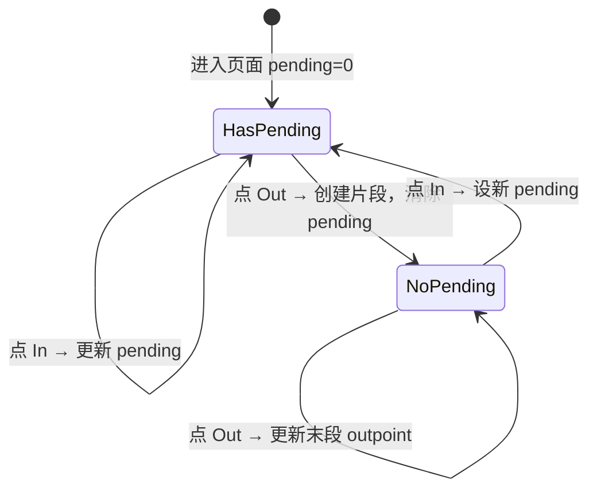

# 交互设计

## 入口

主页视频列表中，每个视频项提供裁剪入口。点击后进入独立的裁剪页面。

## 页面结构

裁剪页面自上而下分为三个区域：

| 区域 | 内容 |
|------|------|
| 预览区 | 关键帧画面预览 + 时间显示（拖动时双时间） |
| 操作区 | 进度条 + inpoint/outpoint 设置按钮 |
| 片段列表 | 已选片段展示 + 删除操作 |

```
┌────────────────────────────────────┐
│ 标题栏: 文件名              [确认]  │
├────────────────────────────────────┤
│         ┌──────────────────┐       │
│         │  关键帧预览画面    │       │
│         └──────────────────┘       │
│    拖动: 00:01:32.100              │
│    关键帧: 00:01:30.500            │
│                                    │
│  [◀]├──●────────────────────┤[▶]  │
│  0:00         进度条         3:45  │
│                                    │
│  [设为 inpoint]   [设为 outpoint]  │
├────────────────────────────────────┤
│ 已选片段:                          │
│  #1  00:04.004 → 00:28.028  [×]   │
│  #2  01:00.060 → 02:15.215  [×]   │
└────────────────────────────────────┘
```

## 进度条行为

### 布局

进度条两侧各有一个方向导航按钮：

```
   [◀]  ═══════════════●═══════════  [▶]
        00:00                  09:29
```

### 拖动过程

| 阶段 | 行为 | 说明 |
|------|------|------|
| 拖动中 | 显示拖动位置时间和最近关键帧时间 | 100ms 防抖触发关键帧预览 |
| 松开 | 停在松手位置，显示吸附中状态 | 不跳回旧位置 |
| 吸附完成 | 跳到关键帧位置 | 吸附期间禁用所有操作按钮 |

### 拖动预览

拖动过程中使用尾部防抖（trailing debounce）触发预览：

```
拖动位置:  ─●──●──●──●──────────────●──●
防抖计时:  └x └x └x └── 100ms ──▶ 触发
结果:      只在用户停顿 100ms 后触发一次查找
```

预览图区域叠加加载指示器，保留旧帧不闪烁。

### prev/next 导航

| 按钮 | 行为 |
|------|------|
| ◀ (prev) | 跳到当前位置前一个关键帧 |
| ▶ (next) | 跳到当前位置后一个关键帧 |

按钮在吸附中或预览加载中（统称"忙碌"状态）时禁用。导航时自动探测缓存间隙（见关键帧缓存设计）。

### 吸附规则

"最近关键帧"取法：

| 候选 | 时间 | 说明 |
|------|------|------|
| 前关键帧 | ≤ T 的最大关键帧时间 | 始终存在（至少有文件起始的 I帧） |
| 后关键帧 | > T 的最小关键帧时间 | 可能不存在（T 已在最后一个关键帧之后） |

取两者中与 T 时间差更小的。如果只有一个候选，直接选该候选。

## 片段设置流程

### 状态机



### 按钮行为

| 当前状态 | 操作 | 行为 |
|---------|------|------|
| pending 存在 | 点 In | 更新 pending 为当前位置 |
| pending 存在 | 点 Out | 创建片段(pending, current)，清除 pending |
| pending 不存在 | 点 In | 设新 pending 为当前位置 |
| pending 不存在 | 点 Out | 更新最后一个片段的 outpoint |

两个按钮始终可见。忙碌状态（吸附中或预览加载中）时禁用。

### 约束

| 约束 | 说明 |
|------|------|
| inpoint 可重复设置 | 每次点击覆盖上一次，直到设置 outpoint 才锁定 |
| outpoint > inpoint | 终点必须在起点之后，否则提示错误 |
| 片段不重叠 | 新片段与已有片段不能重叠，重叠时提示 |
| 时间均为关键帧 | inpoint 和 outpoint 只能是关键帧时间 |

## 片段列表

| 功能 | 说明 |
|------|------|
| 显示 | 按时间顺序排列，格式 `#N  HH:MM:SS.mmm → HH:MM:SS.mmm` |
| pending 项 | pending inpoint 存在时，末尾显示 `#N  HH:MM:SS.mmm → (待设置)` |
| 删除 | 每项有删除按钮；删除 pending 项清除 pending 状态 |
| 空列表 | 确认时等效"不裁剪"，使用完整视频 |

## 确认与返回

| 操作 | 行为 |
|------|------|
| 确认 | 始终可用。将片段列表保存到视频的裁剪配置，返回主页 |
| 返回 | 始终可用。放弃本次修改，取消正在执行的异步任务，返回主页 |
| 清除裁剪 | 片段列表为空时确认，清除已有裁剪配置 |

### 忙碌状态

忙碌 = 吸附中 或 预览加载中。忙碌期间：

| 控件 | 状态 |
|------|------|
| 进度条 | 禁用拖动 |
| prev/next 导航按钮 | 禁用 |
| In/Out 设置按钮 | 禁用 |
| 确认 | **始终可用** — 保存当前状态，不等待异步操作 |
| 返回 | **始终可用** — 丢弃修改，终止异步操作 |

### 预览区时间显示

| 状态 | 显示 |
|------|------|
| 未拖动 | `当前: HH:MM:SS.mmm`（关键帧时间） |
| 拖动中 | 两行：`拖动: HH:MM:SS.mmm` + `关键帧: HH:MM:SS.mmm` |
