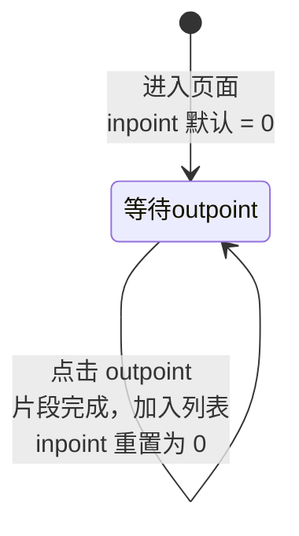

# 交互设计

## 入口

主页视频列表中，每个视频项提供裁剪入口。点击后进入独立的裁剪页面。

## 页面结构

裁剪页面自上而下分为三个区域：

| 区域 | 内容 |
|------|------|
| 预览区 | 关键帧画面预览 + 当前时间显示 |
| 操作区 | 进度条 + inpoint/outpoint 设置按钮 |
| 片段列表 | 已选片段展示 + 删除操作 |

```
┌────────────────────────────────────┐
│ 标题栏: 文件名           [确认] [取消] │
├────────────────────────────────────┤
│         ┌──────────────────┐       │
│         │  关键帧预览画面    │       │
│         └──────────────────┘       │
│          当前: 00:01:30.500        │
│                                    │
│  ├──●─────────────────────────┤   │
│  0:00         进度条         3:45  │
│                                    │
│  [设为 inpoint]   [设为 outpoint]  │
├────────────────────────────────────┤
│ 已选片段:                          │
│  #1  00:04.004 → 00:28.028  [×]   │
│  #2  01:00.060 → 02:15.215  [×]   │
└────────────────────────────────────┘
```

## 进度条行为

### 拖动过程

| 阶段 | 行为 | 说明 |
|------|------|------|
| 拖动中 | 实时显示当前拖动位置的时间 | 不触发关键帧查找，不加载预览 |
| 松开 | 查找最近关键帧 → 吸附 → 加载预览 | 吸附后进度条位置和时间同步更新 |

### 吸附规则

"最近关键帧"取法：

| 候选 | 时间 | 说明 |
|------|------|------|
| 前关键帧 | ≤ T 的最大关键帧时间 | 始终存在（至少有文件起始的 I帧） |
| 后关键帧 | > T 的最小关键帧时间 | 可能不存在（T 已在最后一个关键帧之后） |

取两者中与 T 时间差更小的。如果只有一个候选，直接选该候选。

## 片段设置流程

两个按钮始终可见，但只有当前阶段的按钮高亮可点击，另一个灰色禁止。

### 按钮状态

| 当前阶段 | inpoint 按钮 | outpoint 按钮 |
|---------|-------------|--------------|
| 等待 outpoint | **高亮可点击**（可重复点击重置） | **高亮可点击** |

进入页面时 inpoint 默认为 0（视频开头），直接处于等待 outpoint 阶段。



### 操作说明

| 操作 | 结果 |
|------|------|
| 点击 inpoint | 将当前吸附时间设为 inpoint（可反复点击，每次覆盖上一次的值） |
| 点击 outpoint | 以当前 inpoint 和当前吸附时间组成片段，加入列表；inpoint 重置为 0 |

### 约束

| 约束 | 说明 |
|------|------|
| inpoint 可重复设置 | 每次点击覆盖上一次，直到设置 outpoint 才锁定 |
| outpoint > inpoint | 终点必须在起点之后，否则提示错误 |
| 片段不重叠 | 新片段与已有片段不能重叠，重叠时提示 |
| 时间均为关键帧 | inpoint 和 outpoint 只能是关键帧时间 |

## 片段列表

| 功能 | 说明 |
|------|------|
| 显示 | 按时间顺序排列，格式 `#N  HH:MM:SS.mmm → HH:MM:SS.mmm` |
| 删除 | 每项有删除按钮，删除后列表自动重排 |
| 空列表 | 确认时等效"不裁剪"，使用完整视频 |

## 确认与取消

| 操作 | 行为 |
|------|------|
| 确认 | 将片段列表保存到视频的裁剪配置，返回主页 |
| 取消 | 放弃本次修改，返回主页 |
| 清除裁剪 | 片段列表为空时确认，清除已有裁剪配置 |
