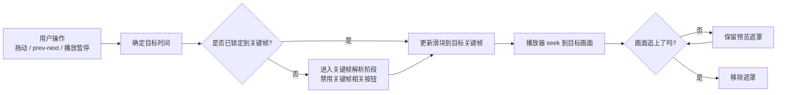
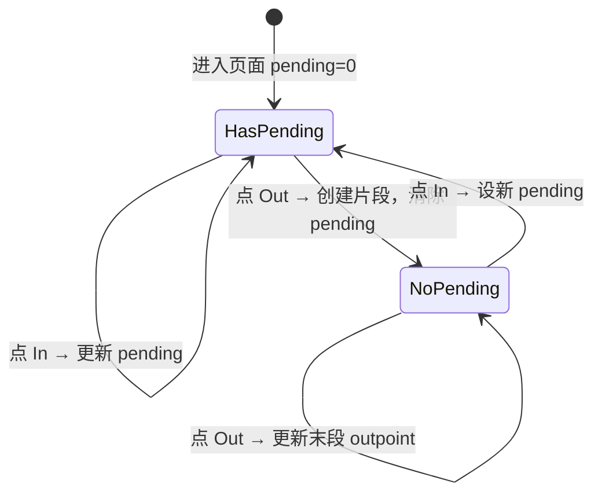

# 交互设计

## 入口

主页视频列表中，每个视频项提供裁剪入口。点击后进入独立的裁剪页面。

## 页面结构

裁剪页面自上而下分为三个区域：

| 区域 | 内容 |
|------|------|
| 预览区 | 连续视频预览 + 时间显示 + 画面同步遮罩 |
| 操作区 | prev / play-pause / next + 进度条 + inpoint/outpoint |
| 片段列表 | 已选片段展示 + 删除操作 |

```text
┌────────────────────────────────────┐
│ 标题栏: 文件名              [确认]  │
├────────────────────────────────────┤
│         ┌──────────────────┐       │
│         │   视频连续预览     │       │
│         │   （必要时遮罩）   │       │
│         └──────────────────┘       │
│    拖动: 00:01:32.100              │
│    关键帧: 00:01:30.500            │
│                                    │
│ [◀] [⏯]├──●──────────────────┤[▶] │
│  0:00         进度条         3:45  │
│                                    │
│  [设为 inpoint]   [设为 outpoint]  │
├────────────────────────────────────┤
│ 已选片段:                          │
│  #1  00:04.004 → 00:28.028  [×]   │
│  #2  01:00.060 → 02:15.215  [×]   │
└────────────────────────────────────┘
```

## 进度条与播放器联动

### 整体原则

滑块位置、关键帧定位和视频画面必须始终围绕**同一个目标时间**同步：



### 拖动过程

| 阶段 | 行为 | 说明 |
|------|------|------|
| 拖动中 | 显示拖动位置时间和最近关键帧时间 | 100ms 防抖更新关键帧候选；播放器实时 seek 到拖动位置 |
| 松开后未吸附 | 显示吸附中状态 | 当前时间未锁定到关键帧，prev/next 和 in/out 禁用 |
| 关键帧已确定 | 进度条立即跳到目标关键帧 | 关键帧相关按钮恢复 |
| 画面未同步 | 预览区继续显示转圈圈 | 直到播放器 position 追上目标 |

### 播放过程

| 阶段 | 行为 | 说明 |
|------|------|------|
| 播放中 | 进度条跟随播放器 position 连续前进 | 当前时间未对齐关键帧，prev/next 和 in/out 禁用 |
| 点击暂停 | 以当前播放位置为输入，寻找最近关键帧 | 进入关键帧解析阶段 |
| 关键帧已确定 | 进度条跳到目标关键帧 | 画面未同步时继续显示遮罩 |

### prev/next 导航

| 按钮 | 当前位置 | 行为 |
|------|---------|------|
| ◀ (prev) | 关键帧 | 跳到前一个关键帧 |
| ◀ (prev) | 虚拟末尾 | 跳到最后关键帧 |
| ▶ (next) | 关键帧（有后继） | 跳到后一个关键帧 |
| ▶ (next) | 最后关键帧（无后继） | 跳到虚拟末尾 |
| ▶ (next) | 虚拟末尾 | 无操作 |

导航按钮只在**时间未吸附**阶段禁用；如果关键帧已确定但画面还没追上，按钮应恢复可用。

## 两级加载状态

### 时间未吸附

表示目标时间还没有被锁定到关键帧，用户不能在这个时间点上执行关键帧相关操作。

| 触发场景 | UI 行为 |
|------|------|
| 播放中 | prev/next 与 in/out 禁用；暂停与拖动仍可用 |
| 拖动中 | prev/next 与 in/out 禁用；拖动位置与最近关键帧同时显示 |
| 松手/暂停后找关键帧 | prev/next 与 in/out 禁用；进度条停留在用户目标附近 |

### 画面未同步

表示关键帧目标已经确定，时间相关操作可以恢复，但播放器画面还没有真正 seek 到目标。

| 触发场景 | UI 行为 |
|------|------|
| 松手后已找到关键帧 | 进度条跳到目标关键帧，预览区继续显示遮罩 |
| 暂停后已找到关键帧 | 关键帧按钮恢复，预览区继续显示遮罩 |
| prev/next 已确定目标 | 时间文字与进度条立刻更新，遮罩等待画面追上 |

## 吸附规则

"最近关键帧"取法：

| 候选 | 时间 | 说明 |
|------|------|------|
| 前关键帧 | ≤ T 的最大关键帧时间 | 始终存在（至少有文件起始的 I 帧） |
| 后关键帧 | > T 的最小关键帧时间 | 可能不存在（T 已在最后一个关键帧之后） |

取两者中与 T 时间差更小的。如果只有一个候选，直接选该候选。

## 虚拟末尾

视频时长（duration）作为最后关键帧之后的虚拟吸附点，用于实现左闭右开区间 `[in, out)` 选到视频末尾。

| 语义 | 说明 |
|------|------|
| 吸附点 | 当目标时间落在最后关键帧之后时，duration 参与最近点比较 |
| 画面 | 虚拟末尾没有独立画面，继续显示最后关键帧对应的画面 |
| outpoint | 作为 outpoint 时省略终点参数，由解码器读到文件末尾 |

## 片段设置流程

### 状态机



### 按钮行为

| 当前状态 | 操作 | 行为 |
|---------|------|------|
| pending 存在 | 点 In | 更新 pending 为当前位置 |
| pending 存在 | 点 Out | 创建片段(pending, current)，清除 pending |
| pending 不存在 | 点 In | 设新 pending 为当前位置 |
| pending 不存在 | 点 Out | 更新最后一个片段的 outpoint |

两个按钮始终可见。只有在**时间未吸附**阶段禁用；**画面未同步**不会阻止 In/Out。

## 忙碌状态总表

| 控件 | 播放中 / 拖动中 / 关键帧解析中 | 画面未同步 | 说明 |
|------|------------------------------|-----------|------|
| 进度条 | **可拖动** | **可拖动** | 拖动会打断当前解析/同步流程 |
| prev/next 导航按钮 | 禁用 | **可用** | 只依赖“时间是否已吸附” |
| In/Out 设置按钮 | 禁用 | **可用** | 只依赖“时间是否已吸附” |
| 播放/暂停 | **可用** | **可用** | 用于中断或继续播放 |
| 确认 | **始终可用** | **始终可用** | 保存当前片段配置 |
| 返回 | **始终可用** | **始终可用** | 丢弃修改并退出 |

## 预览区时间显示

| 状态 | 显示 |
|------|------|
| 关键帧 | `当前: HH:MM:SS.mmm` |
| 虚拟末尾 | `当前: HH:MM:SS.mmm (末尾)` |
| 拖动中 | 两行：`拖动: HH:MM:SS.mmm` + `关键帧: HH:MM:SS.mmm` |
