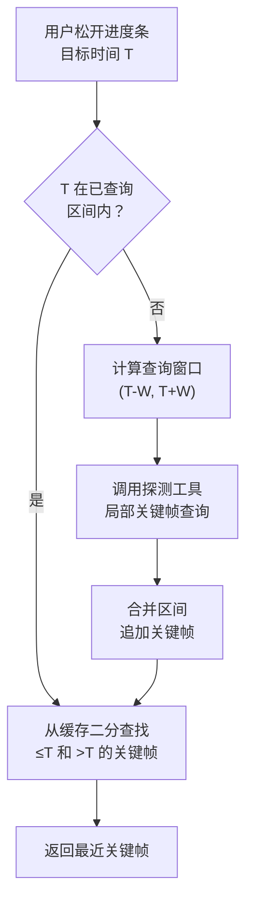

# 关键帧缓存

## 问题

用户拖动进度条时需要频繁查找附近关键帧。每次调用探测工具查询整个文件效率低下，即使使用局部时间窗口查询，同一区域的重复查询也是浪费。

## 方案：区间缓存

为每个视频维护两组数据：

| 数据 | 结构 | 说明 |
|------|------|------|
| 已查询区间 | 有序区间列表 `[(start, end), ...]`（微秒） | 记录已经被探测工具扫描过的时间范围 |
| 关键帧列表 | 有序整数列表 `[t1, t2, t3, ...]`（微秒） | 已发现的所有关键帧时间戳 |

## 查找流程



## 区间合并

新查询的区间需要与已有区间合并，避免碎片化：

| 操作 | 示例 |
|------|------|
| 初始 | `[]` |
| 查询 (10, 30) | `[(10, 30)]` |
| 查询 (50, 70) | `[(10, 30), (50, 70)]` |
| 查询 (25, 55) | `[(10, 70)]`（三个区间合并） |

合并规则：新区间与所有重叠或相邻（间距 ≤ 1s）的已有区间合并为一个。

## 判断是否需要查询

```
输入: 目标时间 T
遍历已查询区间:
  如果存在区间 [start, end] 使得 start ≤ T ≤ end:
    返回"已覆盖"
  否则:
    返回"未覆盖"
```

## 窗口大小策略

| 参数 | 值 | 说明 |
|------|-----|------|
| 默认窗口 W | 10 秒 | 覆盖大多数 GOP 长度（1~4s），±10s 内至少 2~5 个关键帧 |
| 最大窗口 | 30 秒 | 防止异常大的查询 |
| 扩大策略 | W × 2 | 窗口内无关键帧时翻倍重试 |
| 最大重试 | 3 次 | 10s → 20s → 30s 后放弃 |

## 边界处理

| 场景 | 处理 |
|------|------|
| 查询区间 start < 0 | 截断为 0 |
| 查询区间 end > 视频时长 | 截断为视频时长 |
| 查询返回空（无关键帧） | 扩大窗口重试 |
| 全部重试后仍无关键帧 | 报告异常（视频可能无关键帧或格式异常） |

### 关键帧最少保证

任何有效视频**至少有一个关键帧**（通常在文件起始位置）。视频解码器必须从关键帧开始才能工作，因此第一帧必然是 I帧。

| 边界情况 | 说明 |
|---------|------|
| 首帧 PTS ≠ 0 | B帧重排序可能导致首帧显示时间戳稍大于 0，但第一个关键帧的 DTS 仍为 0 |
| 仅一个关键帧 | 极短视频或截图格式，全片只有一帧。此时只能选择该唯一时间点 |
| 损坏文件 | ffprobe 解析失败时报告错误，不属于"无关键帧"场景 |

因此"窗口内无关键帧"仅在窗口未覆盖到实际关键帧时发生（如 GOP 特别长），扩大窗口后必定能找到。

## 缓存生命周期

| 事件 | 处理 |
|------|------|
| 进入裁剪页面 | 创建或恢复缓存 |
| 离开裁剪页面 | 保留缓存（同一会话内再次进入可复用） |
| 删除视频项 | 清除对应缓存 |
| 应用退出 | 不持久化，下次启动重新探测 |

## 最近关键帧查找

在有序关键帧列表中查找最近关键帧（二分查找）：

```
输入: 有序列表 keyframes, 目标时间 T
找到 idx = 第一个 > T 的位置（upper_bound）

前关键帧 = keyframes[idx - 1]  // 如果 idx > 0
后关键帧 = keyframes[idx]      // 如果 idx < 列表长度

返回 |T - 前关键帧| ≤ |后关键帧 - T| ? 前关键帧 : 后关键帧
```
