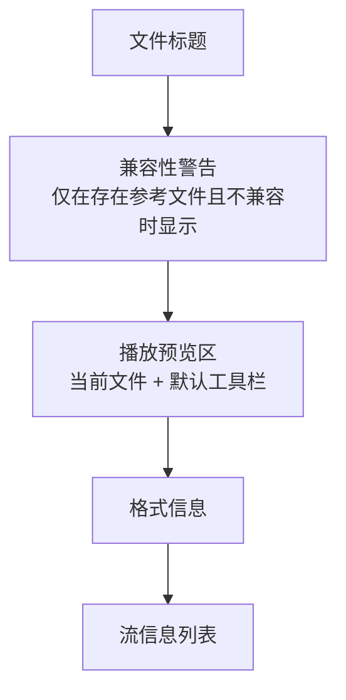
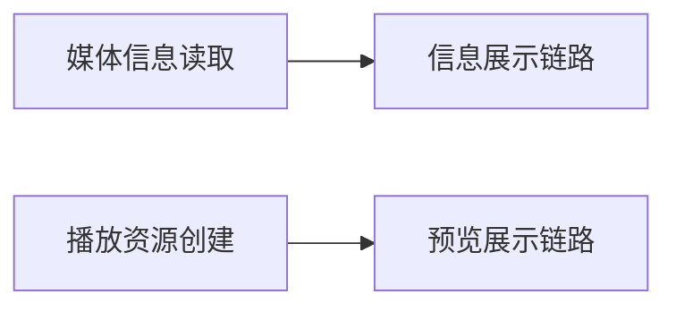

# 视频信息播放预览

## 目标

视频信息页除了展示容器、编码参数、流信息之外，还应提供一个**面向当前文件的普通播放器预览区**，让用户在查看参数时能直接确认画面与时长信息。

这个预览区的目标是“标准播放体验”，不是裁剪页那种受业务规则驱动的专用播放器。

## 页面结构

页面结构遵循以下顺序：

| 区块 | 作用 |
|------|------|
| 兼容性警告 | 说明当前文件与参考文件的参数差异 |
| 播放预览区 | 预览当前文件的画面与基础播放状态 |
| 格式信息 | 容器、时长、大小、码率等概要信息 |
| 流信息列表 | 视频流、音频流及其他流的详细参数 |

## 边界

| 主题 | 规则 |
|------|------|
| 播放对象 | 只播放当前文件，不播放参考文件 |
| 默认行为 | 页面打开后不自动播放，用户手动开始 |
| 控件形态 | 使用播放器库提供的默认完整工具栏 |
| 业务耦合 | 不与裁剪、关键帧、吸附、外部滑块联动 |
| 错误影响范围 | 播放区失败只影响播放区，不升级为整页失败 |

## 结构原则

视频信息页需要把两条链路分开：

1. **信息展示链路**：负责读取容器与流参数，并渲染格式信息与流信息。
2. **预览展示链路**：负责创建播放器资源、打开媒体、显示默认控件。

两条链路同页共存，但不互相污染状态。这样可以保证：

- 信息读取失败时，页面按信息页的错误模型处理；
- 播放器失败时，问题被局部限制在预览区；
- 后续若替换播放器表现，不必改动信息展示结构。

## 交互规则

| 场景 | 行为 |
|------|------|
| 存在视频流 | 显示普通播放器预览区 |
| 不存在视频流 | 显示“无法预览”的静态提示 |
| 存在参考文件 | 参考文件只参与参数对比，不进入播放链路 |
| 打开页面 | 只加载媒体，不自动开始播放 |
| 用户交互 | 使用默认工具栏提供播放、暂停、拖动、时间显示 |

## 默认播放器策略

视频信息页属于“普通播放器”场景，应优先使用库提供的默认完整控件，而不是定制一套业务工具栏。适用原因：

- 页面目标是预览，不是精细编辑；
- 不需要关键帧吸附或外部时间轴联动；
- 标准控件已经满足播放、暂停、拖动和时间显示。

## 降级与失败处理

| 情况 | 处理方式 |
|------|----------|
| 没有视频流 | 预览区显示静态降级提示 |
| 播放资源初始化失败 | 预览区显示局部错误信息 |
| 信息读取失败 | 整页按信息读取失败处理 |

这种分层处理的核心原则是：**视频信息页首先是信息页，播放器只是附加能力。**
